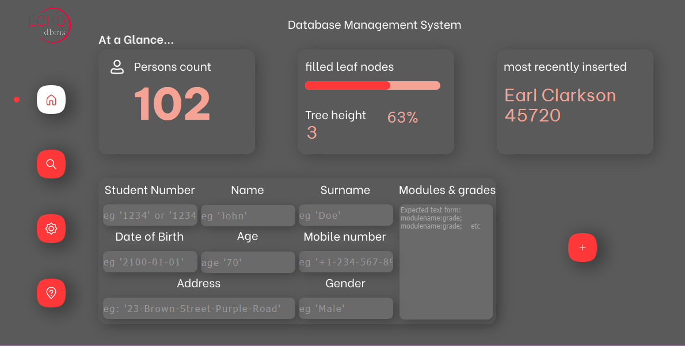
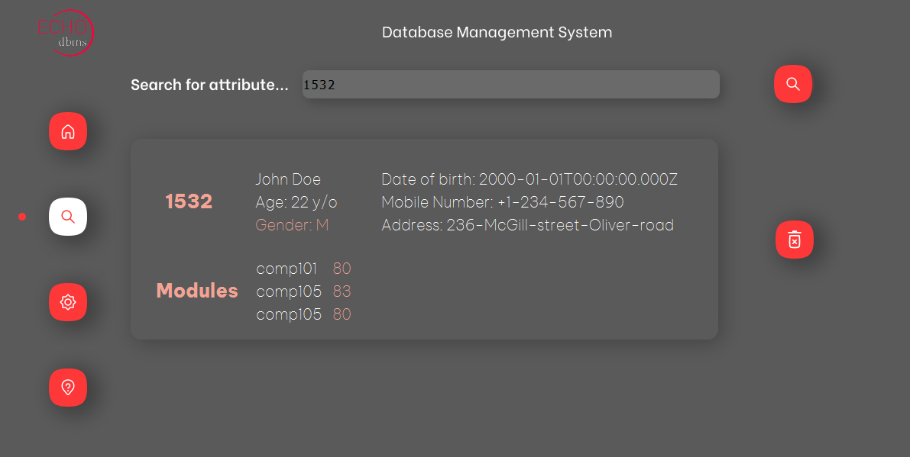

# b-plus-tree-dbms
A dbms which manages students in a bplus tree data structure and has a gui to interact with the bplus tree

# preview images
home page

search page

#steps to run this application

1.  Download the project files.
2.  Download IntelliJ from here: https://www.jetbrains.com/idea/download/?source=google&medium=cpc&campaign=9736964638&term=intellij&gclid=Cj0KCQjw94WZBhDtARIsAKxWG-8VaCtrTKUAL_6Ja3_7vDQu2YRCuJF8UTm7Or6MWGZCLCfgPvZiF1QaAqL8EALw_wcB#section=windows
3.  Download JavaFx files from here: https://gluonhq.com/products/javafx/ (what I used: OS-Windows, Version-18, Architecture-x64, Type-SDK
4.  Save the files to a global path that you can easily access on your computer eg: 'C:\<your paths>\JavaFX'
5.  Open IntelliJ and click open and select the path where you saved the project files
6.  When the project has loaded, you may turn to your left where you'll see a section in the projects area labeled as 'External Libraries'. You should see 2 libraries there, one labelled as  <openjdk 18> and another as lib. 
